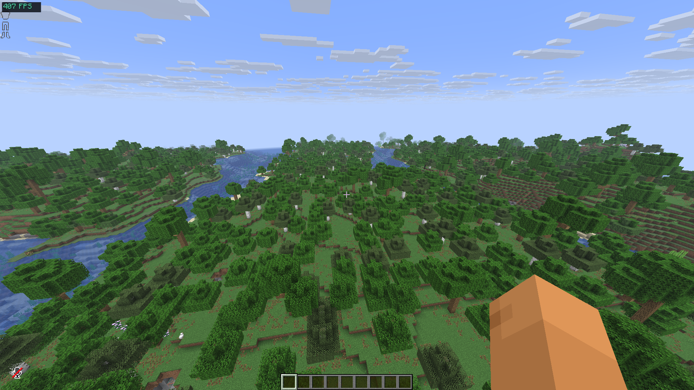
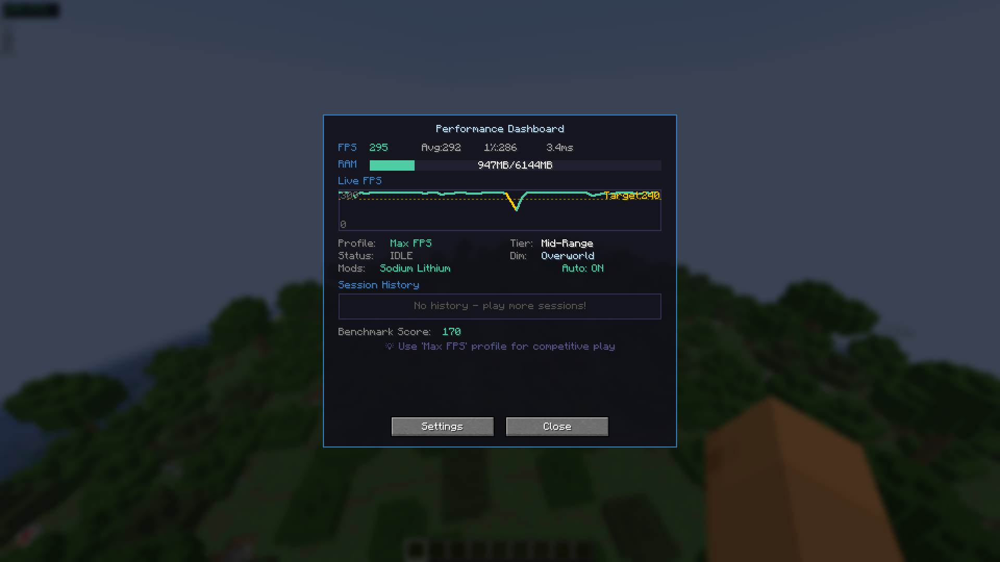

# Smart FPS Booster

**Intelligent auto-optimization mod for Minecraft that configures settings based on your hardware and gameplay style.**

## Features

- **Smart Profiles** - Max FPS, Balanced, Quality, Battery Saver
- **Live FPS Dashboard** - Real-time graph, memory usage, session history
- **Revamped UI** - Modern dashboard with gradient panels, stat cards and charts
- **Dynamic Optimization** - Movement, combat, heavy scene detection
- **Setting Locks** - Protect specific settings from auto-changes
- **Lag Spike Alert** - Optional red screen-edge flash on FPS drops (toggle in Settings → Visuals & Alerts)
- **Mod Detection** - Works with Sodium, Lithium, Iris

## Keybinds

| Key | Action |
|-----|--------|
| F8 | Open Dashboard |
| F9 | Toggle Auto-Optimize |
| F10 | Cycle Profiles |

## Installation

1. Install [Fabric Loader](https://fabricmc.net/use/installer/)
2. Install [Fabric API](https://modrinth.com/mod/fabric-api)
3. Download Smart FPS Booster from [Modrinth](https://modrinth.com/mod/smart-fps-booster)
4. Put `.jar` in `mods` folder
5. Press F8 in-game!

## Supported Versions

- Minecraft 26.1 & 26.2 (Fabric) — requires Java 25
- Requires [Fabric API](https://modrinth.com/mod/fabric-api)

> Older Minecraft versions (1.20.x – 1.21.x) are supported by Smart FPS Booster v1.x releases.

## Changelog

See [CHANGELOG.md](CHANGELOG.md) for the full version history.

## Screenshots

## License

MIT License

## Support

- [Report Issues](https://github.com/devxkamlesh/smart-fps-booster/issues)
- [Buy Me a Coffee](https://www.buymeacoffee.com/devxkamlesh)
